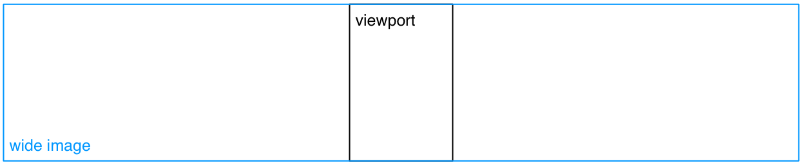

# Panel navigation

Historically, scroll can be vertical or horizontal. In Korea and France, most scrolls are vertical, but there are horizontal use cases also.

In some use cases, 

- the author wants to block the screen mode (landscape / portrait). 
- the starting point is not top-left but at some coordinates
- scroll is not "free" and the author wants to add "snap points". 

## Fragmenting the page

A zone in a page may be a panel ("case" in French), a set of panels or any other rectangular area of an image.

note: currently the W3C only defines rectangular media fragments. AHL also defines polygons and radial fragments: this may be complex to implement, therefore we'll stick with rectangles. 

note: the best practice is to use percentages.

json sample:

	{
		"href": "page1.jpg#xywh=percent:5,5,15,15",
		"type": "image/jpeg"
	}

issue = panels can be of very different size and the definition of an image, once zoomed full screen, can therefore be of low quality.

## Scaling

Let's consider a portrait viewport, a landscape viewport and two images or fragments: a square one and a wide one (5:1 aspect ratio).

A `fit` may be applied to the image so that it is scaled (up or down) to the viewport size. The aspect ratio must be preserved. Possible options are `height`, `width`, `both`, `optimize` and `custom`.

### height

### width

### both

This corresponds to the notion of "aspect fit". In EPUB FXL, the default "fit" is `both`. We'll stick with it.  

### optimize

This corresponds to the notion of "aspect fill". `optimize` (`fill`? `crop`?) means that the fit is done on one dimension, which depends on both the viewport and image aspect ratios, in order to optimize the display of the image.

### custom

`custom` allows to define the minimum amount of image data that must be displayed, regardless of the relative aspect ratios of the image/fragment and the viewport. This option can be useful when the image is  very tall (resp. wide) with a landscape (resp. portrait) viewport.

The `custom` attribute is defined as a percentage of the largest dimension of the image.

*Question: should we define it as an aspect ratio instead?*

Sample: 

	{
		"href": "page1.jpg",
		"type": "image/jpeg",
		"properties": {
			"fit": "custom#percent:20"
		}
	}

## Positioning

The scaled image may be positioned relative to the viewport by using `position-x` and `position-y` options.

The values given to these options are used as percentages relative to both the viewport and the image/fragment, so that the top left corner of the image/fragment is superposed to the top left corner of the viewport with (0, 0), and the bottom right corner of the image is superposed to the bottom right corner of the viewport with (100, 100). (50, 50) centers the image within the viewport.

- The default value for position-y is 50 (image centered vertically).
- The default value for position-x depends on the reading direction: 0 for left to right, 100 for right to left.

## Snap points

They may be placed on each image, or placed on fragments of wide/long images. 

They will be used to:

- define a starting point (first snap point)
- define positions for previous/next events
- stop inertial scrolling on touch screens
- trigger actions (inline? through reference?)
	- manage sounds
	- manage layers (backgrounds)

study: study the CSS snap points.

	{
		"href": "page1.jpg#xywh=percent:5,5,15,15",
		"type": "image/jpeg",
		"properties": {
			"fit": "custom#xywh=percent:0,0,20,100",
			"snap-x": {"align": "left", "positions": [0]}
		}
	}

## Fragment-based Navigation

An ordered collection of fragments allows guided navigation between fragments.

Questions: 
should we allow multiple levels of navigation?
should this collection be separate, or should the fragments be included in the spine?
- if we have several collections, they must be separate.
should we accept several collections?
- interesting if they are conditions, media based 
- but requires metadata to select the good done.
response : no

In guided navigation mode, background color information may be ignored.

## Transitions between fragments

The transitions defined between pages are also applicable between fragments.

## Should guided navigation and scroll be compatible in the same UX? 

see [webtoons brothers-bond ep-2](http://www.webtoons.com/en/action/brothers-bond/ep-2/viewer?title_no=1191&episode_no=3)

