# Scroll

Scroll can be vertical or horizontal. Classical scroll on the Web is vertical (see webtoons) but many sequential works present an horizontal scroll (see turbomedia).

In some use cases: 

- the author wants to block the screen mode (landscape / portrait). 
- the starting point is not top-left but at some coordinates
- scroll is not "free" and the author wants to add "snap points". 

## Scaling

Let's consider a portrait viewport, a landscape viewport and two images or fragments: an image with a 1:1 aspect ratio and a wide image (5:1 aspect ratio).

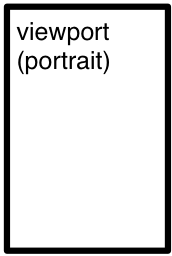 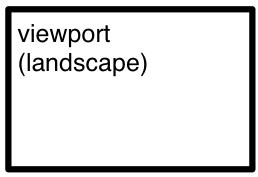  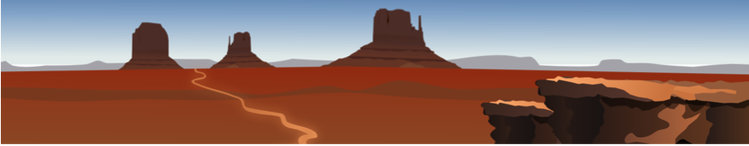
*Source: [https://publicdomainvectors.com](https://publicdomainvectors.com)*

A `fit` may be applied to the image so that it is scaled (up or down) to the viewport size. The aspect ratio must be preserved. Possible options are `height`, `width`, `both`, `optimize` and `ratio`.

### height

  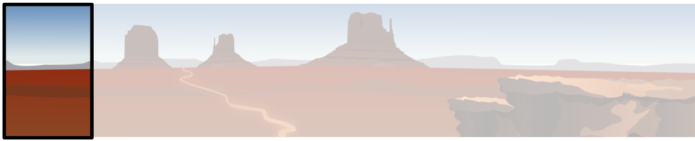 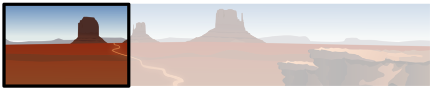

### width

  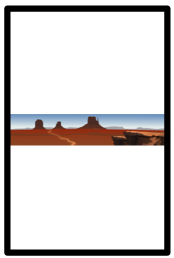 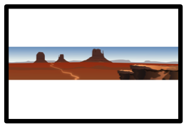

### both

This corresponds to the notion of "aspect fit". In EPUB FXL, the default "fit" is `both`. We'll stick with it.  

   

### fill

This corresponds to the notion of "aspect fill". `fill` (`optimize`? `crop`?) means that the fit is done on one dimension, which depends on both the viewport and image aspect ratios, in order to optimize the display of the image.

   

### ratio

`ratio` allows to define the minimum amount of image data that must be displayed, regardless of the relative aspect ratios of the image/fragment and the viewport. This option can be useful when the image is  very tall (resp. wide) with a landscape (resp. portrait) viewport.

Given an aspect ratio, the largest rectangle that fits inside the viewport is used to scale the image in "fill" mode.

- Example: 1:1 aspect ratio

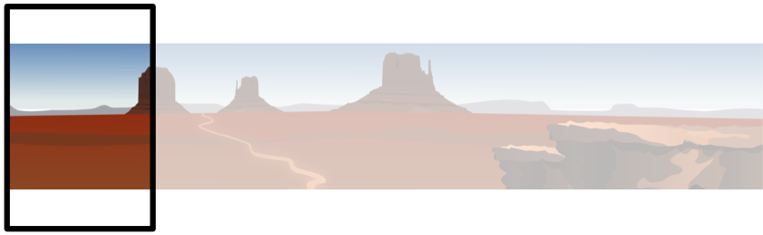 

	{
		"href": "page1.jpg",
		"type": "image/jpeg",
		"properties": {
			"fit": "ratio#1:1"
		}
	}

- Example: 4:3 aspect ratio

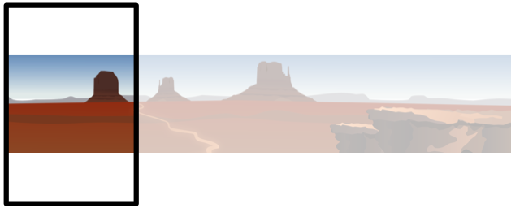 

	{
		"href": "page1.jpg",
		"type": "image/jpeg",
		"properties": {
			"fit": "ratio#4:3"
		}
	}

- Example: 2:1 aspect ratio

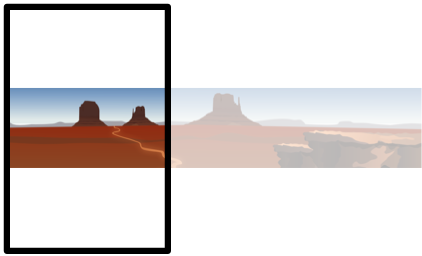 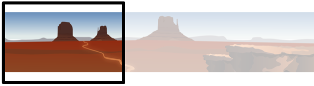

	{
		"href": "page1.jpg",
		"type": "image/jpeg",
		"properties": {
			"fit": "ratio#2:1"
		}
	}


## Positioning

The scaled image may be positioned relative to the viewport by using `position-x` and `position-y` options.

The values given to these options are used as percentages relative to both the viewport and the image/fragment, so that the top left corner of the image/fragment is superposed to the top left corner of the viewport with (0, 0), and the bottom right corner of the image is superposed to the bottom right corner of the viewport with (100, 100). (50, 50) centers the image within the viewport.

- The default value for position-y is 50 (image centered vertically in the viewport).
- The default value for position-x is 0. 

***Question: should the position-x be 50 by default? When the image is narrower than the viewport, we may prefer it centered by default rather than moved to the left or to the right of the viewport.***

If the scroll direction is right to left, position 0 is on the right of the viewport. 


- Example: center horizontally

  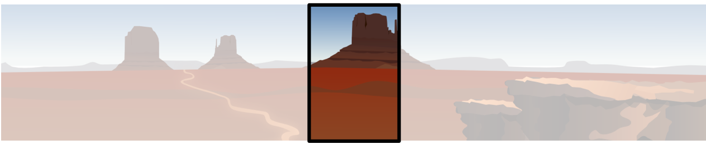 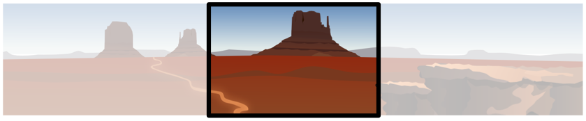

ex.

```json
	{
		"href": "page1.jpg",
		"type": "image/jpeg",
		"properties": {
			"fit": "fill",
			"position-x": 20
		}
	}
```

## Snap points
Snap points may be defined via a `scoll-snap` property

They may be placed on each image, or placed on fragments of wide/long images. 

They will be used to:

- stop inertial scrolling on touch screens
- trigger actions (inline? through reference?)
	- manage sounds
	- manage layers

ex.

```json
	{
		"href": "page1.jpg",
		"type": "image/jpeg",
		"properties": {
			"fit": "height",
			"scroll-snap-x": {"positions": [0, 20, 50, 75]}
		}
	}
```

***Question: should we define `scroll-snap` instead of `scroll-snap-x`? the scroll can only go in one direction, which depends on the image ratio vs viewport ratio and the fit value. But it would make more difficult the mapping to CSS Scroll Snap. Should we define a `scroll-direction` to solve this issue? ***

# Relation to CSS Scroll Snap

A scroll container may be opted into scroll snapping by using `scroll-snap-type` property. This tells the browser that it should consider snapping this scroll container to the snap positions produced by its descendents. `scroll-snap-type` determines the axis on which scrolling occurs: `x`, `y`, or `both`' and the snapping strictness: `mandatory`, `proximity`.

In our case scroll-snap is transformed to `scroll-snap-type: x mandatory;` (resp `y`) depending the image ratio vs viewport ratio and the fit value

A snap position can be produced by declaring a desired alignment on an element, via `scroll-snap-align`. This position is the scroll offset at which the nearest ancestor scroll container and the element are aligned as specified for the given axis. The following alignments are possible on each axis: `start`, `end`, `center`.

In our case the alignment is always `center`.

Snapport is the area of the scroll container to which the snap areas are aligned. By default it is the same as the visual viewport of the scroll container but it can be adjusted using scroll-padding property.

In our case the snapport is always the visual viewport.

