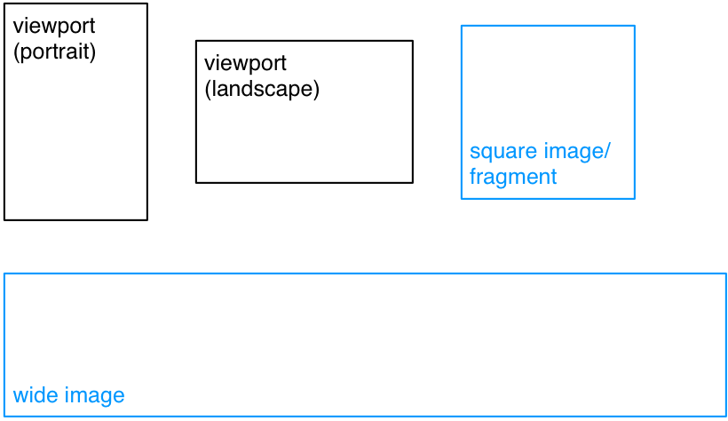
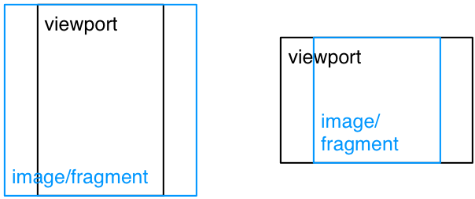
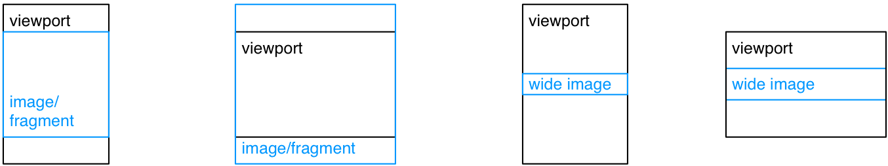
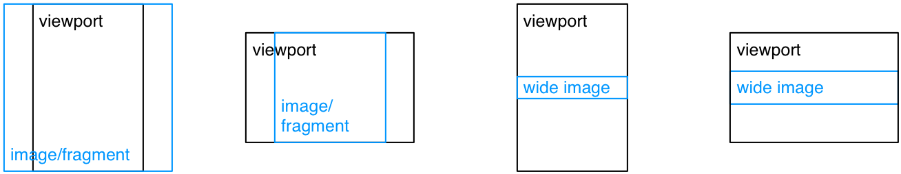
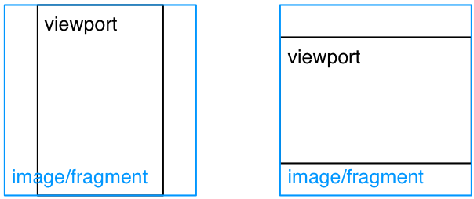
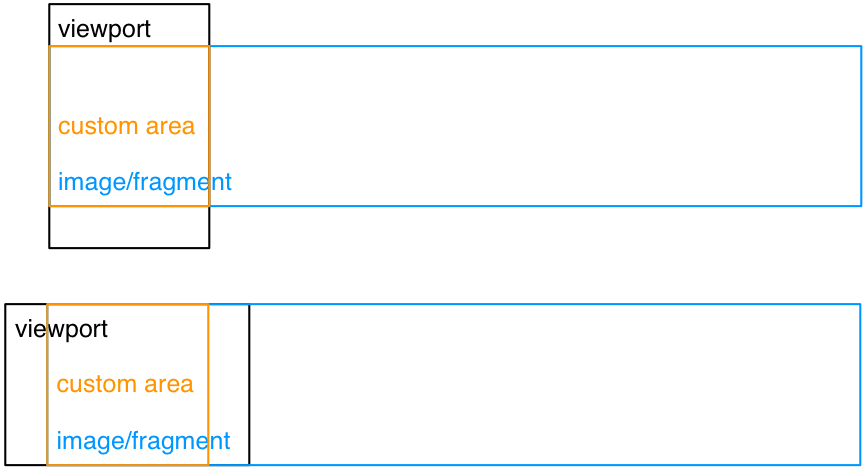
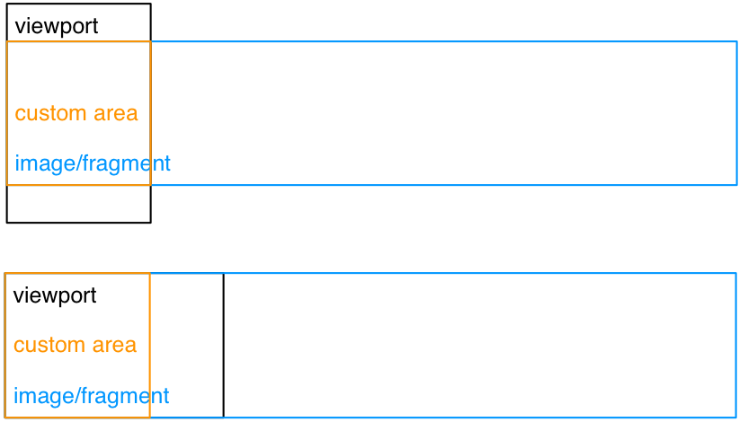

# Scroll on variable pages

Historically, scroll can be vertical or horizontal. In Korea and France, most scrolls are vertical, but there are horizontal use cases also.

In some use cases, 

- the author wants to block the screen mode (landscape / portrait). 
- the starting point is not top-left but at some coordinates
- scroll is not "free" and the author wants to add "snap points". 

## Fragment in the page

A zone may be a panel ("case"), a set of panels or any other rectangular area of an image.

note: currently the W3C only defines rectangular media fragments. AHL also defines polygons and radial fragments: this may be complex to implement, therefore we stick with rectangles. 

note: the best practice is to use percentages.

	{
		"href": "page1.jpg#xywh=percent:5,5,15,15",
		"type": "image/jpeg"
	}

issue = not all "cases" have the same size and the definition of the zoomed image can therefore be of low quality.

## Positioning & Zoom

A `fit` may be applied on screen `height`, `width`, `both`, `optimize` or `custom`.

### height

### width

### both

In EPUB FXL, the default "fit" is `both`. We'll stick with it.

### optimize

`optimize` (`fill`? `crop`?) means that the fit is done on one dimension, which depends on both the viewport and image aspect ratios, in order to optimize the display of the image.

### custom

`custom` allows to define a starting point and the minimum amount of data that must be displayed initially, via a rectangle defined inside the fragment.

	{
		"href": "page1.jpg",
		"type": "image/jpeg",
		"properties": {
			"fit": "custom#xywh=percent:0,0,20,100"
		}
	}

## Snap points

They may be placed on each image, or placed on fragments of wide/long images. 

They will be used to:

- define a starting point (first snap point)
- define positions for previous/next events
- stop inertial scrolling on touch screens
- trigger actions (inline? through reference?)
	- manage sounds
	- manage layers (backgrounds)

study: study the CSS snap points.

	{
		"href": "page1.jpg#xywh=percent:5,5,15,15",
		"type": "image/jpeg",
		"properties": {
			"fit": "custom#xywh=percent:0,0,20,100",
			"snap-x": {"align": "left", "positions": [0]}
		}
	}

## Should guided navigation and scroll be compatible in the same UX? 

see [http://www.webtoons.com/en/action/brothers-bond/ep-2/viewer?title\_no=1191&episode\_no=3]()

